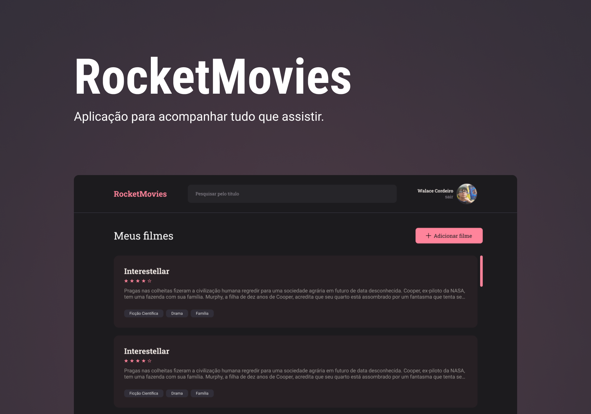

<h1 align="center"> RocketMovies</h1>

Application to track everything you watch.

  <a href="#-technologies">Technologies</a>&nbsp;&nbsp;&nbsp;|&nbsp;&nbsp;&nbsp;
  <a href="#-project">Project</a>&nbsp;&nbsp;&nbsp;|&nbsp;&nbsp;&nbsp;
  <a href="#-layout">Layout</a>&nbsp;&nbsp;&nbsp;|&nbsp;&nbsp;&nbsp;
  <a href="#memo-license">License</a>

  

 

  

## 🚀 Technologies

This project was developed with the following technologies:

- HTML
- CSS
- JavaScript
- React
- Git e Github
- Figma

## 💻 Project

This project is a foundation for object-oriented programming along with API connection.

## 🔖 Layout

You can view the project layout through [THIS LINK](https://www.figma.com/file/cyA9Nfo9DJy4z3ulMEYmIn/RocketMovies-(Copy)?node-id=201-2&t=L3zSOR6LdzG7uAks-0). A [Figma](https://figma.com) account is required to access it.

## :memo: License

This project is lisenced under the MIT license.

---

Made with ♥ [Join our community!](https://discord.gg/rocketseat) :wave:
